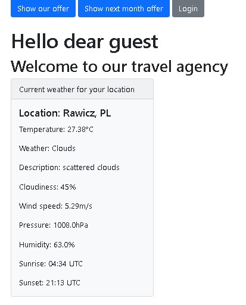

# Project Name
> Outline a brief description of your project.
> Live demo [_here_](https://www.example.com). <!-- If you have the project hosted somewhere, include the link here. -->

## Table of Contents
* [General Info](#general-information)
* [Screenshots](#screenshots)
* [Technologies Used](#technologies-used)

## General Information
- Provide general information about your project here.
- What problem does it (intend to) solve?
- What is the purpose of your project?
- Why did you undertake it?
<!-- You don't have to answer all the questions - just the ones relevant to your project. -->

## Screenshots

<!-- If you have screenshots you'd like to share, include them here. -->

## Technologies Used
- Tech 1 - version 1.0
- Tech 2 - version 2.0
- Tech 3 - version 3.0

